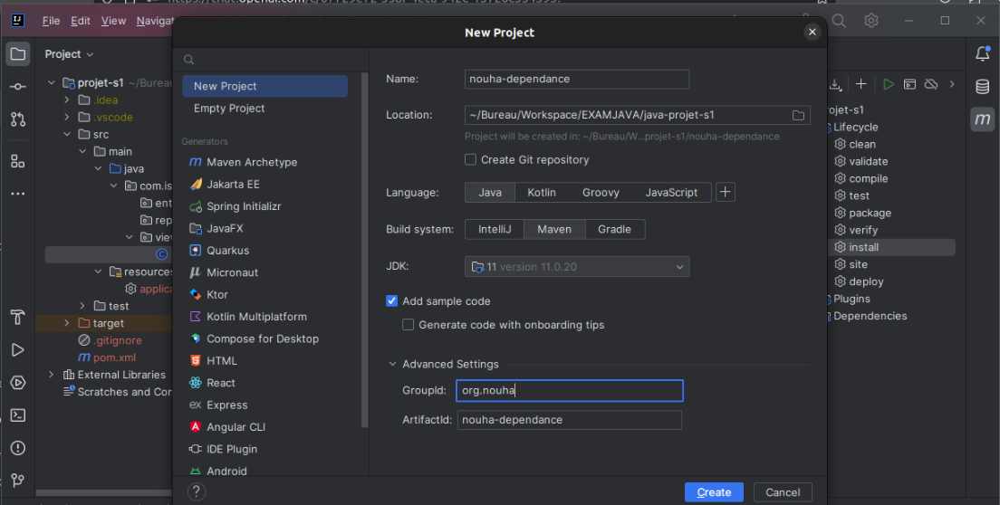
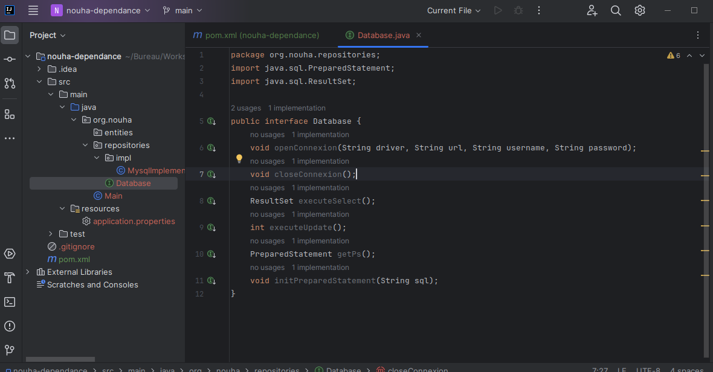
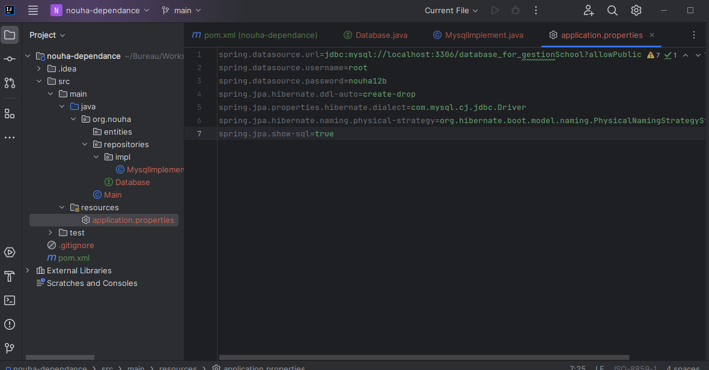
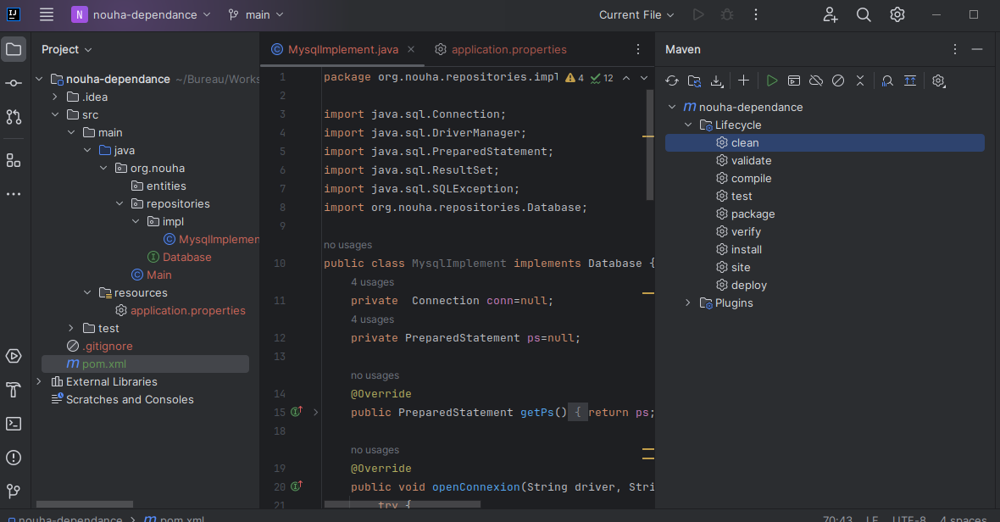
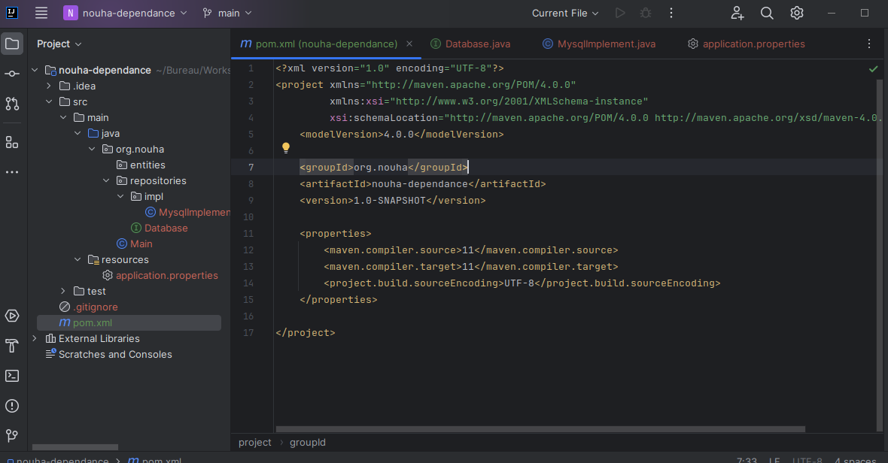

## Comment creer un dependance et le reutiliser dans d'autre projet java avec maven.


Ouvrez votre environnement de développement (IDE) tel que IntelliJ IDEA, Eclipse, ou NetBeans.

1. Créez un nouveau projet Maven.

a. Définissez le groupId, artifactId, et la version du projet Maven. Par exemple :
- groupId: com.votreentreprise
- artifactId: ma-dependance-personnalisee
- version: 1.0-SNAPSHOT




2. Implémentez votre code source :

b. Ajoutez vos classes Java personnalisées, fichiers de ressources ou tout autre contenu spécifique à votre dépendance personnalisée dans le projet.




3. Emballez votre dépendance personnalisée :

c. Assurez-vous que votre projet Maven est correctement configuré, et que le code et les ressources sont prêts pour l'empaquetage.



d. Exécutez mvn clean install dans le répertoire racine de votre projet. Cela construira votre dépendance personnalisée et la placera dans le référentiel local de Maven.



Si vous voulez aussi vous pouvez ouvrir votre terminal et faire un:
```shell
mvn clean install
```


 Utilisez votre dépendance personnalisée dans d'autres projets :
 
 
 Vous devez vous assurer de bien copier les informations de dependance de la ligne 7 a 8

e. Créez un nouveau projet dans votre environnement de développement.

f. Ajoutez votre dépendance personnalisée en tant que dépendance dans le fichier pom.xml de votre nouveau projet. Utilisez les informations de groupId, artifactId, et version que vous avez définies dans l'étape 1.
(vous devez mettre ce que vous aviez copier (ligne 7 a 8) a l'interieur d'un balise <dependency></dependenc>

```xml
<dependencies>
    <dependency>
        <groupId>com.votreentreprise</groupId>
        <artifactId>ma-dependance-personnalisee</artifactId>
        <version>1.0-SNAPSHOT</version>
    </dependency>
    
    <!--Vos autres dependances -->
</dependencies>
```

5. Construisez et exécutez votre projet :

a. Assurez-vous que votre nouveau projet est correctement configuré pour utiliser la dépendance personnalisée.

b. Exécutez mvn clean install dans le répertoire racine de votre nouveau projet pour résoudre et télécharger automatiquement votre dépendance personnalisée.

c. Vous pouvez maintenant construire et exécuter votre projet comme d'habitude.
